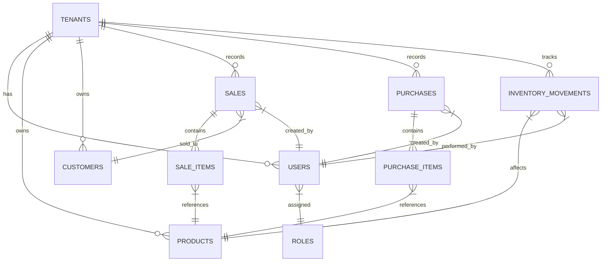

# Phase 1 Data Model: Arus ERP Baseline Schema

**Feature**: `001-initial-baseline`  
**Date**: 2026-08-20  
**Spec**: [spec.md](file:///c:/Users/ioavm/OneDrive/Escritorio/IOAV/Arus/specs/001-initial-baseline/spec.md)  
**Research**: [research.md](file:///c:/Users/ioavm/OneDrive/Escritorio/IOAV/Arus/specs/001-initial-baseline/research.md)

---

## Entity Relationship Summary

---

## Detailed Schema Specifications

### 1. `tenants` (Empresas)
Representa cada empresa o negocio registrado en la plataforma.

| Column | Type | Constraints | Description |
| :--- | :--- | :--- | :--- |
| `id` | `UUID` | `PRIMARY KEY`, Default `gen_random_uuid()` | Identificador único del tenant |
| `name` | `VARCHAR(150)` | `NOT NULL` | Nombre comercial de la empresa |
| `tax_id` | `VARCHAR(50)` | `NOT NULL`, `UNIQUE` | NIT o documento de identificación fiscal |
| `created_at` | `TIMESTAMPTZ` | `NOT NULL`, Default `NOW()` | Fecha y hora de registro (ISO 8601) |
| `status` | `VARCHAR(20)` | `NOT NULL`, Default `'ACTIVE'` | Estado (`ACTIVE`, `INACTIVE`) |

---

### 2. `roles` (Roles del Sistema)
Define los roles disponibles (`Administrador` y `Vendedor`).

| Column | Type | Constraints | Description |
| :--- | :--- | :--- | :--- |
| `id` | `VARCHAR(50)` | `PRIMARY KEY` | Clave del rol (`ADMIN`, `SELLER`) |
| `name` | `VARCHAR(100)` | `NOT NULL` | Nombre descriptivo del rol |
| `description` | `TEXT` | `NULLABLE` | Descripción del nivel de acceso |

---

### 3. `users` (Usuarios / Colaboradores)
Cuentas de usuario asociadas a una empresa.

| Column | Type | Constraints | Description |
| :--- | :--- | :--- | :--- |
| `id` | `UUID` | `PRIMARY KEY`, Default `gen_random_uuid()` | Identificador del usuario |
| `tenant_id` | `UUID` | `NOT NULL`, `FK(tenants.id)` | Empresa a la que pertenece |
| `email` | `VARCHAR(255)` | `NOT NULL`, `UNIQUE(tenant_id, email)` | Correo electrónico de acceso |
| `password_hash` | `VARCHAR(255)` | `NOT NULL` | Hash seguro de la contraseña |
| `full_name` | `VARCHAR(150)` | `NOT NULL` | Nombre completo del usuario |
| `role_id` | `VARCHAR(50)` | `NOT NULL`, `FK(roles.id)` | Rol asignado (`ADMIN` o `SELLER`) |
| `status` | `VARCHAR(20)` | `NOT NULL`, Default `'ACTIVE'` | Estado (`ACTIVE`, `INACTIVE`) |
| `created_at` | `TIMESTAMPTZ` | `NOT NULL`, Default `NOW()` | Fecha de creación |

---

### 4. `products` (Catálogo de Productos)
Artículos comercializables por la empresa.

| Column | Type | Constraints | Description |
| :--- | :--- | :--- | :--- |
| `id` | `UUID` | `PRIMARY KEY`, Default `gen_random_uuid()` | Identificador del producto |
| `tenant_id` | `UUID` | `NOT NULL`, `FK(tenants.id)` | Empresa propietaria |
| `sku` | `VARCHAR(100)` | `NOT NULL`, `UNIQUE(tenant_id, sku)` | Código único de barras / SKU |
| `name` | `VARCHAR(200)` | `NOT NULL` | Nombre comercial del artículo |
| `description` | `TEXT` | `NULLABLE` | Descripción |
| `sale_price` | `NUMERIC(12, 2)`| `NOT NULL`, `CHECK(sale_price >= 0)` | Precio de venta al público |
| `current_stock`| `INTEGER` | `NOT NULL`, `CHECK(current_stock >= 0)` | Existencia actual disponible |
| `status` | `VARCHAR(20)` | `NOT NULL`, Default `'ACTIVE'` | Estado (`ACTIVE`, `INACTIVE`) |
| `created_at` | `TIMESTAMPTZ` | `NOT NULL`, Default `NOW()` | Fecha de creación |

---

### 5. `customers` (Clientes)
Directorio de compradores. Incluye un cliente genérico por defecto "Consumidor Final" por tenant.

| Column | Type | Constraints | Description |
| :--- | :--- | :--- | :--- |
| `id` | `UUID` | `PRIMARY KEY`, Default `gen_random_uuid()` | Identificador del cliente |
| `tenant_id` | `UUID` | `NOT NULL`, `FK(tenants.id)` | Empresa propietaria |
| `name` | `VARCHAR(200)` | `NOT NULL` | Nombre o razón social |
| `tax_number` | `VARCHAR(50)` | `NULLABLE` | Documento de identidad / NIT |
| `phone` | `VARCHAR(50)` | `NULLABLE` | Teléfono de contacto |
| `email` | `VARCHAR(255)` | `NULLABLE` | Correo electrónico |
| `is_default` | `BOOLEAN` | `NOT NULL`, Default `FALSE` | Indica si es "Consumidor Final" |
| `status` | `VARCHAR(20)` | `NOT NULL`, Default `'ACTIVE'` | Estado (`ACTIVE`, `INACTIVE`) |

---

### 6. `sales` (Encabezado de Ventas)
Registro principal de transacciones comerciales de salida (Inmutable).

| Column | Type | Constraints | Description |
| :--- | :--- | :--- | :--- |
| `id` | `UUID` | `PRIMARY KEY`, Default `gen_random_uuid()` | Identificador único de venta |
| `tenant_id` | `UUID` | `NOT NULL`, `FK(tenants.id)` | Empresa que realiza la venta |
| `customer_id` | `UUID` | `NOT NULL`, `FK(customers.id)` | Cliente comprador |
| `user_id` | `UUID` | `NOT NULL`, `FK(users.id)` | Cajero/Vendedor que registró |
| `total_amount` | `NUMERIC(12, 2)`| `NOT NULL`, `CHECK(total_amount >= 0)` | Monto total de la venta |
| `status` | `VARCHAR(20)` | `NOT NULL`, Default `'CONFIRMED'` | Estado (`CONFIRMED`) |
| `created_at` | `TIMESTAMPTZ` | `NOT NULL`, Default `NOW()` | Timestamp inmutable de la venta |

---

### 7. `sale_items` (Renglones de Venta)
Detalle de artículos por venta.

| Column | Type | Constraints | Description |
| :--- | :--- | :--- | :--- |
| `id` | `UUID` | `PRIMARY KEY`, Default `gen_random_uuid()` | Identificador del renglón |
| `sale_id` | `UUID` | `NOT NULL`, `FK(sales.id ON DELETE RESTRICT)` | Venta a la que pertenece |
| `product_id` | `UUID` | `NOT NULL`, `FK(products.id)` | Producto vendido |
| `quantity` | `INTEGER` | `NOT NULL`, `CHECK(quantity > 0)` | Cantidad vendida |
| `unit_price` | `NUMERIC(12, 2)`| `NOT NULL`, `CHECK(unit_price >= 0)` | Precio unitario aplicado |
| `subtotal` | `NUMERIC(12, 2)`| `NOT NULL` | `quantity * unit_price` |

---

### 8. `purchases` (Encabezado de Compras)
Registro de adquisiciones para abastecimiento de inventario.

| Column | Type | Constraints | Description |
| :--- | :--- | :--- | :--- |
| `id` | `UUID` | `PRIMARY KEY`, Default `gen_random_uuid()` | Identificador único de compra |
| `tenant_id` | `UUID` | `NOT NULL`, `FK(tenants.id)` | Empresa compradora |
| `user_id` | `UUID` | `NOT NULL`, `FK(users.id)` | Usuario que registró la compra |
| `total_amount` | `NUMERIC(12, 2)`| `NOT NULL`, `CHECK(total_amount >= 0)` | Costo total de la compra |
| `created_at` | `TIMESTAMPTZ` | `NOT NULL`, Default `NOW()` | Timestamp de registro |

---

### 9. `purchase_items` (Renglones de Compra)
Detalle de productos y costo en compras.

| Column | Type | Constraints | Description |
| :--- | :--- | :--- | :--- |
| `id` | `UUID` | `PRIMARY KEY`, Default `gen_random_uuid()` | Identificador del renglón |
| `purchase_id` | `UUID` | `NOT NULL`, `FK(purchases.id ON DELETE RESTRICT)`| Compra a la que pertenece |
| `product_id` | `UUID` | `NOT NULL`, `FK(products.id)` | Producto adquirido |
| `quantity` | `INTEGER` | `NOT NULL`, `CHECK(quantity > 0)` | Cantidad ingresada |
| `unit_cost` | `NUMERIC(12, 2)`| `NOT NULL`, `CHECK(unit_cost >= 0)` | Costo unitario de adquisición |
| `subtotal` | `NUMERIC(12, 2)`| `NOT NULL` | `quantity * unit_cost` |

---

### 10. `inventory_movements` (Auditoría de Stock)
Registro inmutable de trazabilidad de entradas y salidas de mercancía.

| Column | Type | Constraints | Description |
| :--- | :--- | :--- | :--- |
| `id` | `UUID` | `PRIMARY KEY`, Default `gen_random_uuid()` | ID del movimiento |
| `tenant_id` | `UUID` | `NOT NULL`, `FK(tenants.id)` | Empresa |
| `product_id` | `UUID` | `NOT NULL`, `FK(products.id)` | Producto afectado |
| `movement_type`| `VARCHAR(20)` | `NOT NULL`, `CHECK(movement_type IN ('SALE', 'PURCHASE'))` | Tipo de movimiento |
| `quantity` | `INTEGER` | `NOT NULL` | Cantidad (+ para compra, - para venta) |
| `stock_before` | `INTEGER` | `NOT NULL` | Stock previo al movimiento |
| `stock_after` | `INTEGER` | `NOT NULL` | Stock posterior al movimiento |
| `user_id` | `UUID` | `NOT NULL`, `FK(users.id)` | Usuario responsable |
| `reference_id` | `UUID` | `NOT NULL` | ID de Venta o Compra origen |
| `created_at` | `TIMESTAMPTZ` | `NOT NULL`, Default `NOW()` | Fecha y hora inmutable |

---

## Indexes & Constraints Rules

1. **Multi-Tenant Composite Indexes**:
   - `idx_users_tenant` ON `users(tenant_id, email)`
   - `idx_products_tenant` ON `products(tenant_id, sku)`
   - `idx_customers_tenant` ON `customers(tenant_id)`
   - `idx_sales_tenant_date` ON `sales(tenant_id, created_at DESC)`
   - `idx_purchases_tenant_date` ON `purchases(tenant_id, created_at DESC)`
   - `idx_inv_movements_tenant` ON `inventory_movements(tenant_id, product_id)`

2. **Foreign Key Integrity**:
   - Delete restrictions (`ON DELETE RESTRICT`) on all transactions to prevent physical orphan rows.
