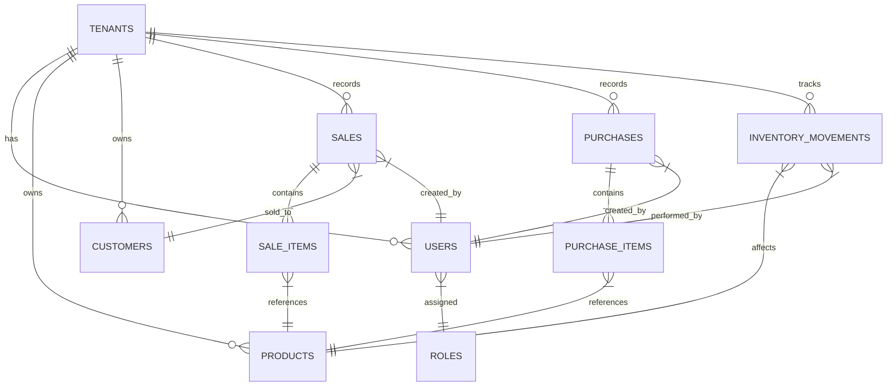
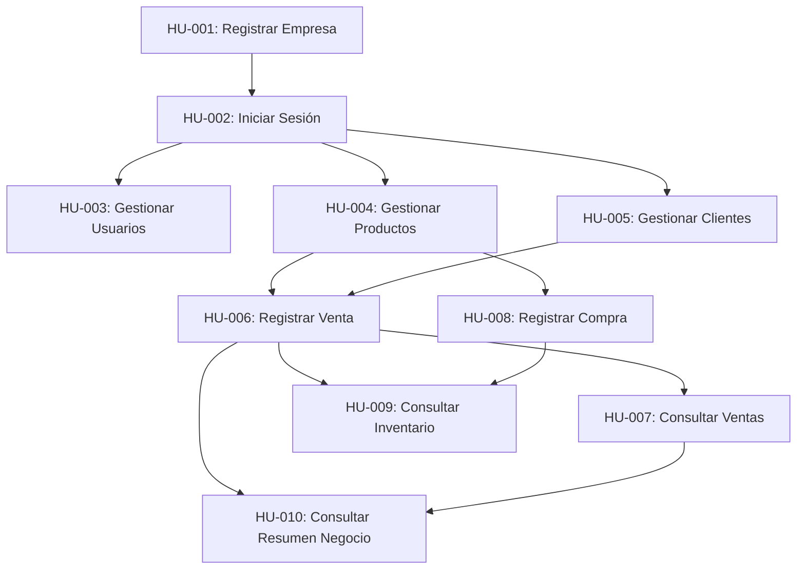

# Implementation Plan: Arus ERP Baseline

**Branch**: `001-initial-baseline` | **Date**: 2026-08-20 | **Spec**: [spec.md](file:///c:/Users/ioavm/OneDrive/Escritorio/IOAV/Arus/specs/001-initial-baseline/spec.md)

**Input**: Feature specification from `/specs/001-initial-baseline/spec.md`

---

## 1. Summary

This plan defines the concrete technical architecture and implementation strategy for the **Arus ERP Baseline (10 User Stories: HU-001 to HU-010)**. The approach employs a **Monolito Modular** structure separating a Python (FastAPI) backend API and a React (Vite) frontend application over a PostgreSQL database. It guarantees strict logical multi-tenancy (`tenant_id` context scope), RBAC (`Administrador` vs `Vendedor`), atomic transactions for sales/purchases with exact decimal precision, and immutable audit logs.

This document serves as the **master technical plan** for the project, consolidating all core architectural decisions, data schemas, API contracts, security controls, and test strategies into a single self-contained reference.

---

## 2. Technical Context

* **Language/Version**: Python 3.11+ (Backend), JavaScript/React 18+ (Frontend)
* **Primary Dependencies**: 
  * Backend: `FastAPI`, `Pydantic v2`, `SQLAlchemy 2.0 (Async)`, `asyncpg`, `Alembic`, `PyJWT`, `passlib[bcrypt]`
  * Frontend: `React 18`, `Vite`, `Axios`, `React Router v6`, `Vanilla CSS`
* **Storage**: PostgreSQL 15+ (Relational, ACID transactions, `DECIMAL(12,2)` monetary precision)
* **Testing**: `pytest`, `pytest-asyncio`, `httpx` (Backend); `Vitest`, `@testing-library/react` (Frontend)
* **Target Platform**: Web application (Linux Server / Containerized / Modern Web Browsers)
* **Project Type**: Web application (Monolito Modular: `backend/` + `frontend/`)
* **Performance Goals**: API response time < 200ms p95, sale transaction + stock deduction completed in < 3s
* **Constraints**: 100% logical multi-tenant isolation, immutable confirmed sales, exact money precision, 2-day delivery window
* **Scale/Scope**: Baseline 10 HUs, multi-tenant enabled from day 1, zero cross-tenant data leakage

---

## 3. Constitution Check

*GATE: Must pass before Phase 0 research. Re-check after Phase 1 design.*

* **Principle I: Priorización del Usuario (UX sin Sacrificar Seguridad)**: PASS. Simple REST API + intuitive React interface with strict backend security validation and error handling.
* **Principle II: UX Simple, Consistente y Accesible**: PASS. Language oriented to business, default "Consumidor Final" customer to streamline sales.
* **Principle III: Arquitectura Monolito Modular**: PASS. Organized as a modular monolith (`backend/src/modules/*` and `frontend/src/*`).
* **Principle IV: Security by Design**: PASS. Secrets isolated in `.env`, passwords hashed with bcrypt, backend RBAC enforcement on all routes.
* **Principle V: Multi-Tenancy Nativo**: PASS. Mandatory `tenant_id` on all tenant entities, extracted from JWT token in backend middleware.
* **Principle VI: Modelo de Autorización Declarativo**: PASS. Hierarchy `Usuario -> Tenant -> Rol (ADMIN | SELLER) -> Permisos` verified in FastAPI dependencies.
* **Principle VII: Integridad Transaccional y Consistencia**: PASS. Sales and purchases execute in atomic DB transactions with row-level locking (`FOR UPDATE`). Decimal types prevent float errors.
* **Principle VIII: Auditoría e Historial Inmutable**: PASS. `inventory_movements` and transactions log user ID, timestamp, and entity impact inmutably. Confirmed sales cannot be edited or deleted.
* **Principle IX: Calidad Automatizada**: PASS. Mandatory automated test suite in `pytest` for business rules, tenant isolation, and API contracts.
* **Principle X: SDD como Control**: PASS. Implementation fully traceable to `spec.md` (HU-001 through HU-010).

---

## 4. Project Structure

### 4.1 Documentation (this feature)

```text
specs/001-initial-baseline/
├── spec.md              # Feature specification (HU-001 to HU-010 + Clarifications)
├── plan.md              # Master Implementation Plan (this file)
├── research.md          # Phase 0 Technical Decisions research artifact
├── data-model.md        # Phase 1 Database Schema artifact
├── quickstart.md        # Phase 1 Runnable Validation Guide artifact
└── contracts/
    └── openapi.json     # Phase 1 OpenAPI REST Contracts artifact
```

### 4.2 Source Code Layout (repository root)

```text
backend/
├── alembic/              # Database migration scripts
│   └── versions/         # Migration versions
├── src/
│   ├── main.py           # FastAPI application entry point & CORS
│   ├── config.py         # Environment configuration (pydantic-settings)
│   ├── database.py       # SQLAlchemy async engine & session maker
│   ├── security.py       # Password hashing (bcrypt) & JWT token management
│   ├── middleware/
│   │   └── tenant.py     # Multi-tenant context extraction middleware
│   ├── modules/
│   │   ├── auth/         # HU-001, HU-002: Tenant & User Registration, Login
│   │   ├── users/        # HU-003: Collaborator management & RBAC
│   │   ├── products/     # HU-004, HU-009: Catalog & Inventory
│   │   ├── customers/    # HU-005: Customer directory
│   │   ├── sales/        # HU-006, HU-007: Sales processing & history
│   │   ├── purchases/    # HU-008: Purchase processing & stocking
│   │   └── dashboard/    # HU-010: Business summary metrics
│   └── shared/
│       ├── models.py     # Base SQLAlchemy declarative model & tenant mixin
│       └── dependencies.py # Common FastAPI guards (get_db, get_current_user, require_role)
└── tests/
    ├── conftest.py       # Async DB fixtures & test client setup
    ├── contract/         # OpenAPI contract verification tests
    └── unit/             # Stock deduction, decimal math & tenant isolation tests

frontend/
├── public/
├── src/
│   ├── main.jsx          # React app mount
│   ├── App.jsx           # App routes definition & AuthGuard
│   ├── api/
│   │   └── client.js     # Axios instance with JWT interceptor & error handler
│   ├── context/
│   │   └── AuthContext.jsx # Global user, tenant, and role state
│   ├── components/       # Reusable UI components (Navbar, Sidebar, Modal, Table, Input)
│   └── pages/
│       ├── Login.jsx            # HU-002: Login screen
│       ├── RegisterCompany.jsx  # HU-001: Register company screen
│       ├── Dashboard.jsx        # HU-010: Business summary (Admin only)
│       ├── Users.jsx            # HU-003: Collaborator management (Admin only)
│       ├── Products.jsx         # HU-004, HU-009: Catalog & Inventory
│       ├── Customers.jsx        # HU-005: Customer directory
│       ├── Sales.jsx            # HU-006, HU-007: Sales terminal & history
│       └── Purchases.jsx        # HU-008: Stock purchase entry
└── tests/
    └── component/        # Vitest UI rendering tests
```

**Structure Decision**: Monolito Modular Web Application (`backend/` + `frontend/`) separating Python API and React UI, cleanly divided by domain modules.

---

## 5. Architectural & System Design


### 5.1 Communication Protocol
* All client-server interaction uses **HTTP/REST over JSON** with explicit schema contracts.
* Cross-Origin Resource Sharing (CORS) is explicitly configured on FastAPI to whitelist the React frontend origin.
* API responses follow standardized JSON structures for success and error states (HTTP 200/201 for success, 400 for validation errors, 401 for unauthenticated, 403 for unauthorized, 404 for not found).

---

## 6. Multi-Tenant Isolation Strategy

* **Model**: Shared Database, Shared Schema with mandatory `tenant_id` column.
* **JWT Claims**: Tokens contain `sub` (user_id), `tenant_id`, and `role_id` (`ADMIN` | `SELLER`).
* **Backend Dependency Enforcement**:
  Every tenant-scoped API endpoint injects the current tenant context:
  ```python
  async def get_current_tenant_id(
      current_user: User = Depends(get_current_user)
  ) -> uuid.UUID:
      if not current_user.tenant_id:
          raise HTTPException(status_code=401, detail="Invalid tenant context")
      return current_user.tenant_id
  ```
* **Database Query Scoping**:
  All database queries strictly append `.where(Model.tenant_id == current_tenant_id)`. Direct cross-tenant access is physically impossible at the repository layer.

---

## 7. Authentication & Authorization (RBAC)

### 7.1 Roles & Permissions Matrix

| Feature / Endpoint | Route Path | Admin (`ADMIN`) | Seller (`SELLER`) |
| :--- | :--- | :---: | :---: |
| **HU-001**: Register Company | `POST /api/v1/auth/register-company` | Public | Public |
| **HU-002**: Login | `POST /api/v1/auth/login` | Public | Public |
| **HU-003**: List Users | `GET /api/v1/users` | ✅ Allowed | ❌ Denied (403) |
| **HU-003**: Create User | `POST /api/v1/users` | ✅ Allowed | ❌ Denied (403) |
| **HU-003**: Toggle User Status | `PATCH /api/v1/users/{id}/status` | ✅ Allowed | ❌ Denied (403) |
| **HU-004**: Products (CRUD/Status) | `/api/v1/products` | ✅ Allowed | ✅ Allowed |
| **HU-005**: Customers (CRUD/Status) | `/api/v1/customers` | ✅ Allowed | ✅ Allowed |
| **HU-006**: Register Sale | `POST /api/v1/sales` | ✅ Allowed | ✅ Allowed |
| **HU-007**: Consult Sales | `GET /api/v1/sales` | ✅ Allowed | ✅ Allowed |
| **HU-008**: Register Purchase | `POST /api/v1/purchases` | ✅ Allowed | ✅ Allowed |
| **HU-009**: Consult Inventory | `GET /api/v1/products` | ✅ Allowed | ✅ Allowed |
| **HU-010**: Business Summary | `GET /api/v1/dashboard/summary` | ✅ Allowed | ❌ Denied (403) |

---

## 8. Master Data Model & Database Schema



### 8.1 Table Specifications

1. **`tenants`**: `id` (UUID PK), `name` (VARCHAR), `tax_id` (VARCHAR UNIQUE), `created_at` (TIMESTAMPTZ), `status` (VARCHAR).
2. **`roles`**: `id` (VARCHAR PK: 'ADMIN' | 'SELLER'), `name` (VARCHAR), `description` (TEXT).
3. **`users`**: `id` (UUID PK), `tenant_id` (UUID FK), `email` (VARCHAR), `password_hash` (VARCHAR), `full_name` (VARCHAR), `role_id` (VARCHAR FK), `status` (VARCHAR), `created_at` (TIMESTAMPTZ). Unique index: `(tenant_id, email)`.
4. **`products`**: `id` (UUID PK), `tenant_id` (UUID FK), `sku` (VARCHAR), `name` (VARCHAR), `description` (TEXT), `sale_price` (NUMERIC(12,2)), `current_stock` (INTEGER), `status` (VARCHAR: 'ACTIVE' | 'INACTIVE'), `created_at` (TIMESTAMPTZ). Unique index: `(tenant_id, sku)`.
5. **`customers`**: `id` (UUID PK), `tenant_id` (UUID FK), `name` (VARCHAR), `tax_number` (VARCHAR), `phone` (VARCHAR), `email` (VARCHAR), `is_default` (BOOLEAN), `status` (VARCHAR: 'ACTIVE' | 'INACTIVE'). Auto-created default customer: "Consumidor Final".
6. **`sales`**: `id` (UUID PK), `tenant_id` (UUID FK), `customer_id` (UUID FK), `user_id` (UUID FK), `total_amount` (NUMERIC(12,2)), `status` (VARCHAR: 'CONFIRMED'), `created_at` (TIMESTAMPTZ). *Inmutable*.
7. **`sale_items`**: `id` (UUID PK), `sale_id` (UUID FK), `product_id` (UUID FK), `quantity` (INTEGER), `unit_price` (NUMERIC(12,2)), `subtotal` (NUMERIC(12,2)).
8. **`purchases`**: `id` (UUID PK), `tenant_id` (UUID FK), `user_id` (UUID FK), `total_amount` (NUMERIC(12,2)), `created_at` (TIMESTAMPTZ).
9. **`purchase_items`**: `id` (UUID PK), `purchase_id` (UUID FK), `product_id` (UUID FK), `quantity` (INTEGER), `unit_cost` (NUMERIC(12,2)), `subtotal` (NUMERIC(12,2)).
10. **`inventory_movements`**: `id` (UUID PK), `tenant_id` (UUID FK), `product_id` (UUID FK), `movement_type` (VARCHAR: 'SALE' | 'PURCHASE'), `quantity` (INTEGER), `stock_before` (INTEGER), `stock_after` (INTEGER), `user_id` (UUID FK), `reference_id` (UUID), `created_at` (TIMESTAMPTZ).

---

## 9. Core Transactional Logic (Sales & Purchases)

### 9.1 Sale Transaction Flow (`POST /api/v1/sales`)
All sale registrations execute inside an explicit atomic transaction block with row-level locking:

```python
async with session.begin():
    # 1. Lock requested product rows to prevent concurrent overselling
    stmt = (
        select(Product)
        .where(Product.id.in_(product_ids), Product.tenant_id == tenant_id)
        .with_for_update()
    )
    products = (await session.execute(stmt)).scalars().all()
    
    # 2. Validate stock for all items
    for item in request_items:
        product = get_product_by_id(products, item.product_id)
        if product.current_stock < item.quantity:
            raise HTTPException(status_code=400, detail=f"Insufficient stock for {product.name}")
            
    # 3. Deduct stock & create items
    for item in request_items:
        product = get_product_by_id(products, item.product_id)
        stock_before = product.current_stock
        product.current_stock -= item.quantity
        stock_after = product.current_stock
        
        # Log inventory movement
        create_inventory_movement(
            tenant_id=tenant_id,
            product_id=product.id,
            movement_type="SALE",
            quantity=-item.quantity,
            stock_before=stock_before,
            stock_after=stock_after,
            user_id=user_id,
            reference_id=sale.id
        )
    # Transaction commits automatically at exit of session.begin()
```

### 9.2 Purchase Transaction Flow (`POST /api/v1/purchases`)
Executes similarly in an atomic transaction, locking product rows (`WITH FOR UPDATE`), adding stock (`product.current_stock += item.quantity`), and registering `inventory_movements` with `movement_type='PURCHASE'`.

---

## 10. Recommended Implementation Order & HU Dependencies



1. **Step 1 (Foundation & Auth)**: Implement `HU-001` (Register Company) and `HU-002` (Login). Establishes multi-tenant JWT middleware and base database tables (`tenants`, `users`, `roles`).
2. **Step 2 (RBAC & Catalogs)**: Implement `HU-003` (Users), `HU-004` (Products), and `HU-005` (Customers). Habilitates product catalog, customer directory (with default "Consumidor Final"), and collaborator management.
3. **Step 3 (Core Transactions)**: Implement `HU-006` (Register Sale) and `HU-008` (Register Purchase). Implements atomic stock deduction/addition, monetary precision, and `inventory_movements` logging.
4. **Step 4 (Queries & Dashboard)**: Implement `HU-007` (Sales History), `HU-009` (Inventory Query), and `HU-010` (Business Summary). Connects read views and executive metrics.

---

## 11. Testing & Quality Strategy

* **Backend Unit Tests (`pytest`)**:
  * Monetary precision math (`decimal.Decimal` subtotal calculations).
  * Inactivation logic (soft-delete verification).
  * Atomic stock deduction and negative stock rejection.
* **Backend API Integration Tests (`pytest-asyncio` + `httpx`)**:
  * Multi-tenant isolation verification (attempting to read Tenant A data using Tenant B token returns 404/empty).
  * RBAC endpoint protection (attempting to call `/users` or `/dashboard/summary` with `SELLER` token returns 403 Forbidden).
* **Frontend Component Tests (`Vitest`)**:
  * Form validation rendering and route guards navigation.

---

## 12. Technical Risks & Mitigations

* **Risk 1: Race Condition in Concurrent Sales**: Two cashiers selling the last unit of a product simultaneously could result in negative stock.
  * *Mitigation*: Use PostgreSQL row-level locks (`SELECT ... FOR UPDATE`) inside the sale transaction.
* **Risk 2: Multi-Tenant Data Leakage**: Developer forgets to add `.where(Model.tenant_id == tenant_id)` in a query.
  * *Mitigation*: Centralize tenant filtering in base repository/service mixin and enforce multi-tenant isolation unit tests in pytest.
* **Risk 3: Monetary Precision Loss**: Rounding errors when multiplying unit price by quantity.
  * *Mitigation*: Enforce `decimal.Decimal` in Python Pydantic models and SQLAlchemy `Numeric(12, 2)` columns.

---

## 13. Complexity Tracking

> **Constitution Check**: ALL GATES PASSED CLEANLY. Zero violations to justify.

| Violation | Why Needed | Simpler Alternative Rejected Because |
| :--- | :--- | :--- |
| None | N/A | Architecture strictly adheres to Monolito Modular principles without excess complexity. |
