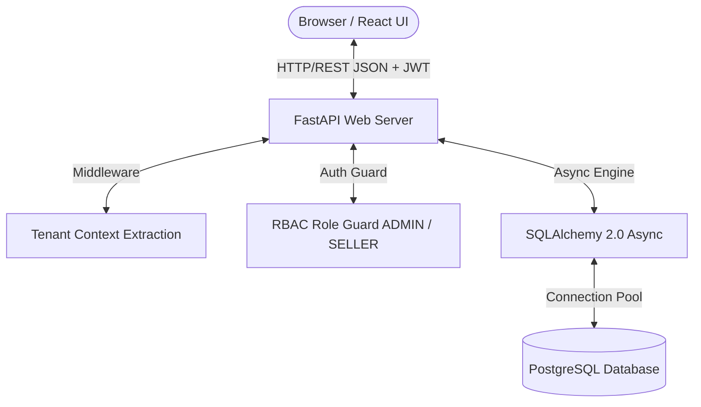
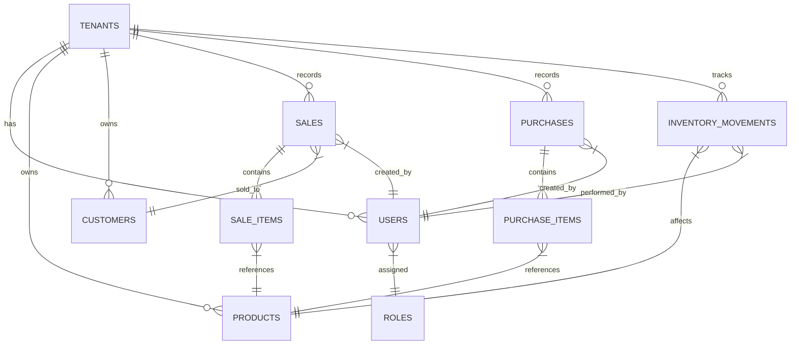
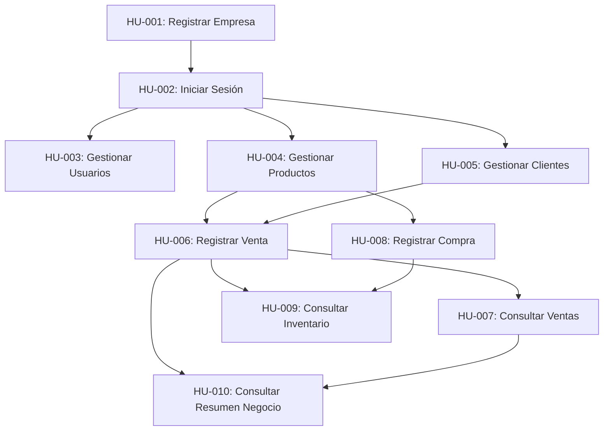
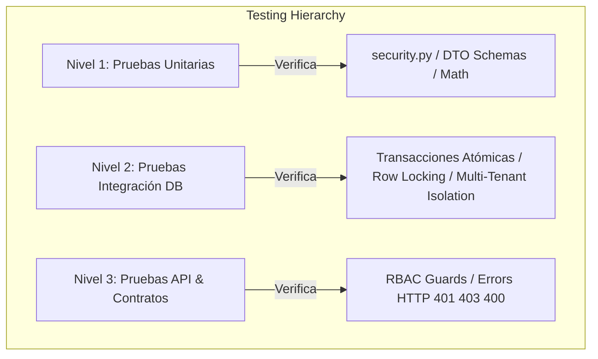

# Implementation Plan: Arus ERP Baseline

**Branch**: `001-initial-baseline` | **Date**: 2026-08-20 | **Last Updated**: 2026-08-21 | **Spec**: [spec.md](file:///c:/Users/ioavm/OneDrive/Escritorio/IOAV/Arus/specs/001-initial-baseline/spec.md)

**Input**: Feature specification from `/specs/001-initial-baseline/spec.md` (Ampliada con Ciberseguridad, Calidad y Pruebas Automatizadas)

---

## 1. Summary

This plan defines the concrete technical architecture and implementation strategy for the **Arus ERP Baseline (10 User Stories: HU-001 to HU-010)**. The approach employs a **Monolito Modular** structure separating a Python (FastAPI) backend API and a React (Vite) frontend application over a PostgreSQL database. It guarantees strict logical multi-tenancy (`tenant_id` context scope), RBAC (`Administrador` vs `Vendedor`), atomic transactions for sales/purchases with exact decimal precision, and immutable audit logs.

This document serves as the **master technical plan** for the project, consolidating all core architectural decisions, data schemas, API contracts, security controls, testing strategies, and QA gates into a single self-contained reference.

---

## 2. Technical Context

* **Language/Version**: Python 3.11+ (Backend), JavaScript/React 18+ (Frontend)
* **Primary Dependencies**: 
  * Backend: `FastAPI`, `Pydantic v2`, `SQLAlchemy 2.0 (Async)`, `asyncpg`, `Alembic`, `PyJWT`, `passlib[bcrypt]`
  * Frontend: `React 18`, `Vite`, `Axios`, `React Router v6`, `Vanilla CSS`
* **Storage**: PostgreSQL 15+ (Relational, ACID transactions, `DECIMAL(12,2)` monetary precision)
* **Testing Stack (No extra tools)**: 
  * Backend: `pytest`, `pytest-asyncio`, `httpx` (Async Client), `sqlite+aiosqlite` in-memory test DB
  * Frontend: `Vitest`, `@testing-library/react`
* **Target Platform**: Web application (Linux Server / Containerized / Modern Web Browsers)
* **Project Type**: Web application (Monolito Modular: `backend/` + `frontend/`)
* **Performance Goals**: API response time < 200ms p95, sale transaction + stock deduction completed in < 3s
* **Constraints**: 100% logical multi-tenant isolation, immutable confirmed sales, exact money precision, >= 80% automated test coverage
* **Scale/Scope**: Baseline 10 HUs, multi-tenant enabled from day 1, zero cross-tenant data leakage

---

## 3. Constitution Check

*GATE: Must pass before Phase 0 research. Re-check after Phase 1 design.*

* **Principle I: Priorización del Usuario (UX sin Sacrificar Seguridad)**: PASS. Simple REST API + intuitive React interface with strict backend security validation and error handling.
* **Principle II: UX Simple, Consistente y Accesible**: PASS. Language oriented to business, default "Consumidor Final" customer to streamline sales.
* **Principle III: Arquitectura Monolito Modular**: PASS. Organized as a modular monolith (`backend/src/modules/*` and `frontend/src/*`).
* **Principle IV: Security by Design**: PASS. Secrets isolated in `.env`, passwords hashed with bcrypt, backend RBAC enforcement on all routes.
* **Principle V: Multi-Tenancy Nativo**: PASS. Mandatory `tenant_id` on all tenant entities, extracted from JWT token in backend middleware.
* **Principle VI: Modelo de Autorización Declarativo**: PASS. Hierarchy `Usuario -> Tenant -> Rol (ADMIN | SELLER) -> Permisos` verified in FastAPI dependencies.
* **Principle VII: Integridad Transaccional y Consistencia**: PASS. Sales and purchases execute in atomic DB transactions with row-level locking (`FOR UPDATE`). Decimal types prevent float errors.
* **Principle VIII: Auditoría e Historial Inmutable**: PASS. `inventory_movements` and transactions log user ID, timestamp, and entity impact inmutably. Confirmed sales cannot be edited or deleted.
* **Principle IX: Calidad Automatizada**: PASS. Mandatory automated test suite in `pytest` for business rules, tenant isolation, and API contracts.
* **Principle X: SDD como Control**: PASS. Implementation fully traceable to `spec.md` (HU-001 through HU-010).

---

## 4. Project Structure

### 4.1 Documentation (this feature)

```text
specs/001-initial-baseline/
├── spec.md              # Feature specification (HU-001 to HU-010 + Clarifications + Section 23 Security & QA)
├── plan.md              # Master Implementation Plan (this file)
├── research.md          # Phase 0 Technical Decisions research artifact
├── data-model.md        # Phase 1 Database Schema artifact
├── quickstart.md        # Phase 1 Runnable Validation Guide artifact
└── contracts/
    └── openapi.json     # Phase 1 OpenAPI REST Contracts artifact
```

### 4.2 Source Code Layout & Test Code Separation

```text
backend/
├── alembic/              # Database migration scripts
│   └── versions/         # Migration versions
├── src/
│   ├── main.py           # FastAPI application entry point & CORS
│   ├── config.py         # Environment configuration (pydantic-settings)
│   ├── database.py       # SQLAlchemy async engine & session maker
│   ├── security.py       # Password hashing (bcrypt) & JWT token management
│   ├── middleware/
│   │   └── tenant.py     # Multi-tenant context extraction middleware
│   ├── modules/
│   │   ├── auth/         # HU-001, HU-002: Tenant & User Registration, Login
│   │   ├── users/        # HU-003: Collaborator management & RBAC
│   │   ├── products/     # HU-004, HU-009: Catalog & Inventory
│   │   ├── customers/    # HU-005: Customer directory
│   │   ├── sales/        # HU-006, HU-007: Sales processing & history
│   │   ├── purchases/    # HU-008: Purchase processing & stocking
│   │   └── dashboard/    # HU-010: Business summary metrics
│   └── shared/
│       ├── models.py     # Base SQLAlchemy declarative model & tenant mixin
│       └── dependencies.py # Common FastAPI guards (get_db, get_current_user, require_role)
└── tests/                # STRICT ISOLATION: Production code does not import test files
    ├── conftest.py       # Async DB fixtures & test HTTP client setup
    ├── contract/         # OpenAPI contract verification tests
    ├── integration/      # Multi-tenant isolation & end-to-end sales history tests
    └── unit/             # Stock deduction, decimal math, auth & RBAC tests

frontend/
├── public/
├── src/
│   ├── main.jsx          # React app mount
│   ├── App.jsx           # App routes definition & AuthGuard
│   ├── api/
│   │   └── client.js     # Axios instance with JWT interceptor & error handler
│   ├── context/
│   │   └── AuthContext.jsx # Global user, tenant, and role state
│   ├── components/       # Reusable UI components
│   └── pages/
│       ├── Login.jsx            # HU-002: Login screen
│       ├── RegisterCompany.jsx  # HU-001: Register company screen
│       ├── Dashboard.jsx        # HU-010: Business summary (Admin only)
│       ├── Users.jsx            # HU-003: Collaborator management (Admin only)
│       ├── Products.jsx         # HU-004, HU-009: Catalog & Inventory
│       ├── Customers.jsx        # HU-005: Customer directory
│       ├── Sales.jsx            # HU-006, HU-007: Sales terminal & history
│       └── Purchases.jsx        # HU-008: Stock purchase entry
└── tests/
    └── component/        # Vitest UI rendering & form validation tests
```

---

## 5. Architectural & System Design



### 5.1 Communication Protocol
* All client-server interaction uses **HTTP/REST over JSON** with explicit schema contracts.
* Cross-Origin Resource Sharing (CORS) is explicitly configured on FastAPI to whitelist the React frontend origin.
* API responses follow standardized JSON structures for success and error states (HTTP 200/201 for success, 400 for validation errors, 401 for unauthenticated, 403 for unauthorized, 404 for not found).

---

## 6. Multi-Tenant Isolation Strategy

* **Model**: Shared Database, Shared Schema with mandatory `tenant_id` column.
* **JWT Claims**: Tokens contain `sub` (user_id), `tenant_id`, and `role_id` (`ADMIN` | `SELLER`).
* **Backend Dependency Enforcement**:
  Every tenant-scoped API endpoint injects the current tenant context:
  ```python
  async def get_current_tenant_id(
      current_user: User = Depends(get_current_user)
  ) -> uuid.UUID:
      if not current_user.tenant_id:
          raise HTTPException(status_code=401, detail="Invalid tenant context")
      return current_user.tenant_id
  ```
* **Database Query Scoping**:
  All database queries strictly append `.where(Model.tenant_id == current_tenant_id)`. Direct cross-tenant access is physically impossible at the repository layer.

---

## 7. Authentication & Authorization (RBAC)

### 7.1 Roles & Permissions Matrix

| Feature / Endpoint | Route Path | Admin (`ADMIN`) | Seller (`SELLER`) |
| :--- | :--- | :---: | :---: |
| **HU-001**: Register Company | `POST /api/v1/auth/register-company` | Public | Public |
| **HU-002**: Login | `POST /api/v1/auth/login` | Public | Public |
| **HU-003**: List Users | `GET /api/v1/users` | ✅ Allowed | ❌ Denied (403) |
| **HU-003**: Create User | `POST /api/v1/users` | ✅ Allowed | ❌ Denied (403) |
| **HU-003**: Toggle User Status | `PATCH /api/v1/users/{id}/status` | ✅ Allowed | ❌ Denied (403) |
| **HU-004**: Products (CRUD/Status) | `/api/v1/products` | ✅ Allowed | ✅ Allowed |
| **HU-005**: Customers (CRUD/Status) | `/api/v1/customers` | ✅ Allowed | ✅ Allowed |
| **HU-006**: Register Sale | `POST /api/v1/sales` | ✅ Allowed | ✅ Allowed |
| **HU-007**: Consult Sales | `GET /api/v1/sales` | ✅ Allowed | ✅ Allowed |
| **HU-008**: Register Purchase | `POST /api/v1/purchases` | ✅ Allowed | ✅ Allowed |
| **HU-009**: Consult Inventory | `GET /api/v1/products` | ✅ Allowed | ✅ Allowed |
| **HU-010**: Business Summary | `GET /api/v1/dashboard/summary` | ✅ Allowed | ❌ Denied (403) |

---

## 8. Master Data Model & Database Schema



---

## 9. Core Transactional Logic (Sales & Purchases)

### 9.1 Sale Transaction Flow (`POST /api/v1/sales`)
All sale registrations execute inside an explicit atomic transaction block with row-level locking:

```python
async with session.begin():
    # 1. Lock requested product rows to prevent concurrent overselling
    stmt = (
        select(Product)
        .where(Product.id.in_(product_ids), Product.tenant_id == tenant_id)
        .with_for_update()
    )
    products = (await session.execute(stmt)).scalars().all()
    
    # 2. Validate stock for all items
    for item in request_items:
        product = get_product_by_id(products, item.product_id)
        if product.current_stock < item.quantity:
            raise HTTPException(status_code=400, detail=f"Insufficient stock for {product.name}")
            
    # 3. Deduct stock & create items
    for item in request_items:
        product = get_product_by_id(products, item.product_id)
        stock_before = product.current_stock
        product.current_stock -= item.quantity
        stock_after = product.current_stock
        
        # Log inventory movement
        create_inventory_movement(
            tenant_id=tenant_id,
            product_id=product.id,
            movement_type="SALE",
            quantity=-item.quantity,
            stock_before=stock_before,
            stock_after=stock_after,
            user_id=user_id,
            reference_id=sale.id
        )
```

---

## 10. Recommended Implementation Order & HU Dependencies



---

## 11. Estrategia Técnica de Ciberseguridad, Calidad y Pruebas Automatizadas

### 11.1 Herramientas y Separación de Código de Pruebas
* **Stack de Testing (Sin agregar librerías innecesarias)**:
  * Backend: `pytest`, `pytest-asyncio`, `httpx` (AsyncClient), `sqlite+aiosqlite` para base de datos aislada en memoria durante ejecución de pruebas.
  * Frontend: `Vitest`, `@testing-library/react`.
* **Separación de Entornos**:
  * Todo el código de pruebas reside en los directorios `backend/tests/` y `frontend/tests/`.
  * Ningún módulo de producción importa archivos de `tests/`. Las dependencias dev/testing (`pytest`, `httpx`) se declaran separadamente en `pyproject.toml` (`[project.optional-dependencies]`) y `package.json` (`devDependencies`).
* **Ejecución Reproducible e Idempotente**:
  * Backend: `pytest backend/tests -v` (ejecuta fixtures de `conftest.py` levantando la base de datos en memoria `sqlite+aiosqlite:///:memory:` que crea y destruye las tablas por cada sesión de test).
  * Frontend: `npm --prefix frontend test` (ejecuta runner de Vitest en modo aislado).

---

### 11.2 Estrategia de Pruebas por Capas y Componentes (Trazabilidad con `spec.md`)



#### Capas Existentes a Probar:
1. **Pruebas Unitarias (Lógica de Negocio y Seguridad)**:
   * **Modulo `backend/src/security.py`**: Pruebas de hasheo y verificación bcrypt (`get_password_hash`, `verify_password`), firmas JWT y expiración (`create_access_token`, `decode_access_token`).
   * **Modulos `backend/src/modules/*/schemas.py`**: Validación DTO de Pydantic v2 ante tipos erróneos, montos negativos (`sale_price < 0`), cantidades inválidas y correos malformados.
2. **Pruebas de Integración y Persistencia (Base de Datos & Transacciones Atómicas)**:
   * **Modulo `backend/src/modules/sales/router.py`**: Verificación de transacción atómica de venta, descuento exacto de stock, bloqueo pesimista `WITH FOR UPDATE`, rechazo por stock insuficiente (HTTP 400) e inmutabilidad.
   * **Modulo `backend/src/modules/purchases/router.py`**: Verificación de adición atómica de existencias.
   * **Modulos `products/router.py` y `customers/router.py`**: Verificación de inactivación lógica (`status = 'INACTIVE'`).
   * **Modulo `backend/src/middleware/tenant.py` (Multi-Tenant Isolation)**: Inyección de peticiones autenticadas como `Tenant_A` intentando acceder a recursos de `Tenant_B`, garantizando respuesta 404 o lista vacía (cero fugas inter-tenant).
3. **Pruebas de API, Contrato y RBAC (Endpoints HTTP)**:
   * **Modulo `backend/src/shared/dependencies.py`**: Verificación de respuestas HTTP 401 Unauthorized ante tokens ausentes/inválidos y HTTP 403 Forbidden para rol `SELLER` al consumir `/api/v1/users` o `/api/v1/dashboard/summary`.

---

### 11.3 Estrategia de Validación de Ciberseguridad (SEC-001 a SEC-007)

1. **`SEC-001` (Validación de Entradas)**: Probado mediante casos de prueba enviando JSONs con inyecciones de código o tipos inválidos a los endpoints; Pydantic y el ORM parametrizado garantizan rechazo 422/400.
2. **`SEC-002` (Credenciales Seguras)**: Probado verificando que la columna `password_hash` en la base de datos guarde hashes `$2b$` y nunca texto plano.
3. **`SEC-003` (Tokens JWT)**: Probado alterando la firma de un token JWT en un test de integración y verificando rechazo HTTP 401.
4. **`SEC-004` (RBAC Backend Enforcement)**: Probado ejecutando HTTP requests a `/users` y `/dashboard/summary` usando token de `SELLER` y asertando HTTP 403 Forbidden.
5. **`SEC-005` (Aislamiento Multi-Tenant)**: Probado en `backend/tests/integration/test_tenant_isolation.py` creando datos con `Tenant_A` y consultando con `Tenant_B`.
6. **`SEC-006` (Protección de Información Sensible)**: Probado verificando que ningún endpoint auth devuelva la clave `password_hash` y que los mensajes de login sean genéricos ("Correo electrónico o contraseña incorrectos").
7. **`SEC-007` (Control de Concurrencia)**: Probado ejecutando solicitudes concurrentes simuladas con `asyncio.gather()` sobre un producto con 1 sola unidad en stock, asertando 1 éxito (201) y 1 rechazo limpio por stock insuficiente (400).

---

### 11.4 Matriz de Trazabilidad Técnica entre Specify y Plan

| Requisito Specify (Sec. 23) | Caso de Prueba (`spec.md`) | Componente / Archivo a Probar (`plan.md`) | Archivo de Test (`plan.md`) |
| :--- | :--- | :--- | :--- |
| **SEC-001 / SEC-002** | TC-001, TC-002 | `backend/src/security.py`, `auth/schemas.py` | `backend/tests/unit/test_register_company.py` |
| **SEC-003 / SEC-006** | TC-003, TC-004 | `backend/src/security.py`, `auth/router.py` | `backend/tests/unit/test_auth.py` |
| **SEC-004** (RBAC) | TC-005, TC-006 | `backend/src/shared/dependencies.py`, `users/router.py` | `backend/tests/unit/test_rbac.py` |
| **SEC-001** (Catalog CRUD) | TC-007, TC-008 | `backend/src/modules/products/router.py` | `backend/tests/unit/test_products.py` |
| **SEC-001** (Customers) | TC-009 | `backend/src/modules/customers/router.py` | `backend/tests/unit/test_customers.py` |
| **SEC-007** (Purchase Stock) | TC-010 | `backend/src/modules/purchases/router.py` | `backend/tests/unit/test_purchases.py` |
| **SEC-007 / QA-003** (Sales Atomicity) | TC-011, TC-012, TC-013 | `backend/src/modules/sales/router.py` | `backend/tests/unit/test_sales.py` |
| **QA-004** (Sales Inmutability) | TC-014 | `backend/src/modules/sales/router.py` | `backend/tests/integration/test_sales_history.py` |
| **QA-001** (Inventory Query) | TC-015 | `backend/src/modules/products/router.py` | `backend/tests/unit/test_inventory.py` |
| **SEC-004** (Dashboard RBAC) | TC-016 | `backend/src/modules/dashboard/router.py` | `backend/tests/integration/test_dashboard.py` |
| **SEC-005 / QA-002** (Multi-Tenant) | TC-017 | `backend/src/middleware/tenant.py` | `backend/tests/integration/test_tenant_isolation.py` |

---

## 12. Technical Risks & Mitigations

* **Risk 1: Race Condition in Concurrent Sales**: Two cashiers selling the last unit of a product simultaneously could result in negative stock.
  * *Mitigation*: Use PostgreSQL row-level locks (`SELECT ... FOR UPDATE`) inside the sale transaction. Tested in `TC-013` / `test_sales.py`.
* **Risk 2: Multi-Tenant Data Leakage**: Developer forgets to add `.where(Model.tenant_id == tenant_id)` in a query.
  * *Mitigation*: Centralize tenant filtering in base repository/service mixin and enforce multi-tenant isolation unit tests in pytest (`TC-017` / `test_tenant_isolation.py`).
* **Risk 3: Monetary Precision Loss**: Rounding errors when multiplying unit price by quantity.
  * *Mitigation*: Enforce `decimal.Decimal` in Python Pydantic models and SQLAlchemy `Numeric(12, 2)` columns.

---

## 13. Complexity Tracking

> **Constitution Check**: ALL GATES PASSED CLEANLY. Zero violations to justify.

| Violation | Why Needed | Simpler Alternative Rejected Because |
| :--- | :--- | :--- |
| None | N/A | Architecture strictly adheres to Monolito Modular principles without excess complexity. |
