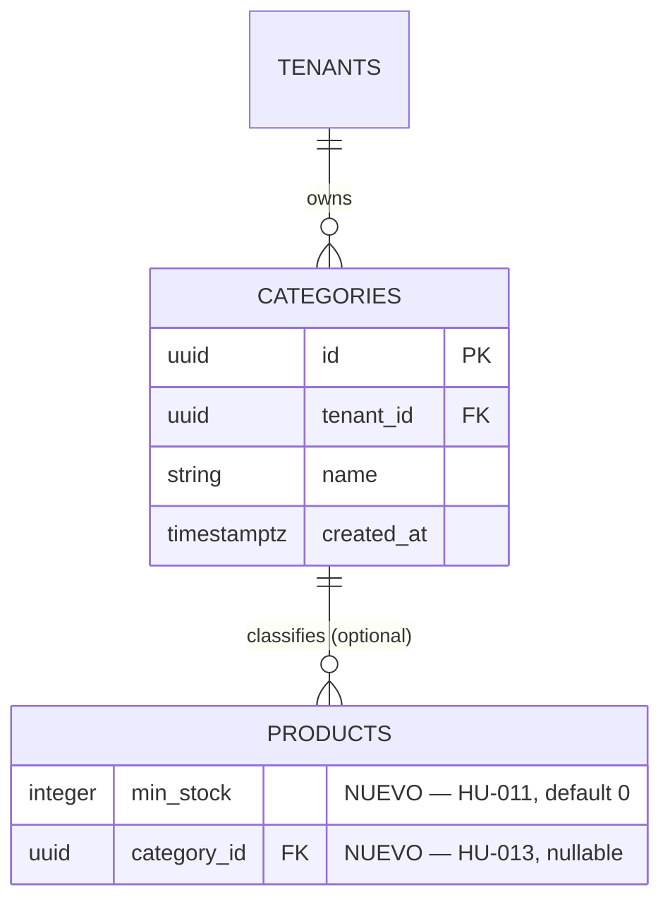

# Phase 1 Data Model: Demo Day Enhancements (delta sobre 001-initial-baseline)

**Feature**: `002-demo-day-enhancements`
**Date**: 2026-08-21
**Spec**: [spec.md](spec.md)
**Baseline schema de referencia**: [001-initial-baseline/data-model.md](../001-initial-baseline/data-model.md)

Este documento describe **únicamente el delta** sobre el esquema ya existente. Ninguna tabla del baseline se elimina, renombra ni sufre una migración destructiva; todos los cambios son aditivos (columnas nullable o con `DEFAULT`, o tablas completamente nuevas).

---

## 1. `products` (tabla existente, extendida — HU-011 + HU-013)

Columnas nuevas agregadas sobre el esquema ya definido en `001-initial-baseline/data-model.md §4`:

| Column | Type | Constraints | HU | Description |
| :--- | :--- | :--- | :--- | :--- |
| `min_stock` | `INTEGER` | `NOT NULL`, `DEFAULT 0`, `CHECK(min_stock >= 0)` | HU-011 | Umbral configurable para el indicador visual "Stock bajo". Productos existentes migran automáticamente con valor `0` (equivalente a "sin umbral definido"). |
| `category_id` | `UUID` | `NULLABLE`, `FK(categories.id)` | HU-013 | Categoría opcional asociada al producto. Productos existentes migran con `NULL` ("sin categoría"), sin afectar su funcionamiento. |

**Compatibilidad**: ambas columnas son seguras de aplicar sobre datos ya existentes sin script de backfill — `min_stock` tiene `DEFAULT 0`, `category_id` es `NULLABLE`.

---

## 2. `categories` (tabla nueva — HU-013)

| Column | Type | Constraints | Description |
| :--- | :--- | :--- | :--- |
| `id` | `UUID` | `PRIMARY KEY`, Default `gen_random_uuid()` | Identificador único de la categoría |
| `tenant_id` | `UUID` | `NOT NULL`, `FK(tenants.id, ondelete="RESTRICT")`, indexado | Empresa propietaria (aislamiento multi-tenant, mismo patrón que `products.tenant_id`) |
| `name` | `VARCHAR(100)` | `NOT NULL`, `UNIQUE(tenant_id, name)` | Nombre de la categoría, único dentro de la empresa |
| `created_at` | `TIMESTAMPTZ` | `NOT NULL`, Default `NOW()` | Fecha de creación |

**Índices**: `idx_categories_tenant` ON `categories(tenant_id)` — mismo patrón que el resto de tablas tenant-scoped del baseline.

---

## 3. Tablas sin cambios (verificado explícitamente)

- **`sales`**, **`sale_items`**: sin cambios de esquema. HU-012 solo agrega parámetros de consulta (`customer_id`, `date_from`, `date_to`) sobre el endpoint `GET /api/v1/sales` ya existente — no hay columnas nuevas ni índices nuevos requeridos (los filtros usan `customer_id` y `created_at`, ambas ya indexadas o filtrables sin índice adicional dado el volumen esperado de un MVP/demo).
- **`users`**: sin cambios de esquema. HU-014 solo actualiza el valor ya existente de `password_hash` mediante el mecanismo de hashing ya vigente (`get_password_hash`, `backend/src/security.py`) — no se agrega ninguna columna.

---

## 4. Diagrama ER (delta)

---

## 5. Reglas de validación derivadas de los Requisitos Funcionales

- `min_stock >= 0` (FR-004, mismo patrón de `CHECK` ya usado en `sale_price`/`current_stock`).
- `categories.name` único por `tenant_id` (FR-007) — rechazo con HTTP 400, mismo patrón que el `sku` duplicado en `products` (HU-004).
- `products.category_id`, si se especifica, DEBE referenciar una categoría del mismo `tenant_id` del producto (FR-008) — validado en la capa de aplicación (`categories/router.py` / `products/router.py`), no solo por la FK de base de datos (la FK por sí sola no impide referenciar una categoría de otro tenant).
